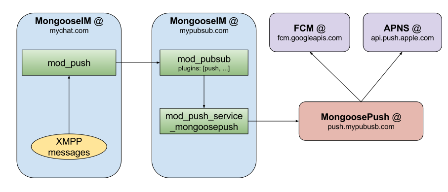
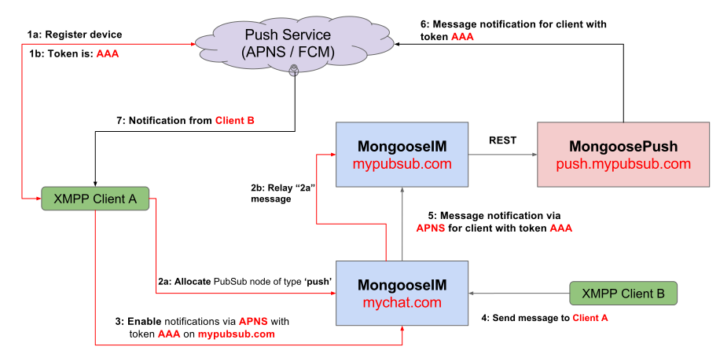

## Push Notifications

MongooseIM server supports push notifications using FCM (**F**irebase **C**loud **M**essaging)
and APNS (**A**pple **P**ush **N**otification **S**ervice) providers. Server side push
notification support is fully compliant with [XEP-0357 Push Notifications][XEP-0357], which defines several components that need to work together in order to provide clients with working push notifications.
The following list shows those components as defined in
[XEP-0357][] and MongooseIM components that correspond to those entities:

  * _XMPP Server_ in MongooseIM is enabled by module [mod_push][]
  * _App Server_ in MongooseIM is enabled by adding a `node_push` node type to [mod_pubsub][]'s configuration
  * _XMPP Push Service_ is implemented as a [MongoosePush][] application

All these entities have to be enabled and properly configured in order to use push notifications.
So let's get to it, shall we?

### Overall component architecture

The components that make push notifications possible in MongooseIM add up to the following architecture:


The diagram lists three domains in total - two for MongooseIM and one for [MongoosePush][]. Note that this separation is not required, all three components can be on the same host with the same domain. 

### Configuring MongooseIM components

Firstly, let's configure all the required MongooseIM components, step by step.

#### [mod_push][] a.k.a. '_XMPP Server_'

The first component that we need to configure in MongooseIM is the [mod_push][] module.
This module communicates with XMPP clients directly in order to enable/disable notifications on per-client basis.

The [mod_push][] module is very easy to enable - just paste the following to your MongooseIM configuration file:

 ```erlang
{mod_push, [
    {wpool, [{workers, 100}]}
]}.
 ```

And that's basically it.
You have just enabled the push notification support with 100 asynchronous workers that will handle all push notification related work.

Let's now consider the case when you need to control the format of push notifications or the state of the user sessions more robustly.
In that case you need to create a plugin module that implements the `mod_push_plugin` behaviour and enable this plugin as specified in [mod_push][] documentation.

#### [mod_pubsub][] with [mod_push_service_mongoosepush][] a.k.a. '_App Server_'

The next component to configure consist of two modules:

  * [mod_pubsub][] with a `push` node type enabled that will act as sink for push notifications generated by [mod_push][] 
  * [mod_push_service_mongoosepush][] - a connector to [MongoosePush][] application.

##### [mod_pubsub][]'s `push` node

According to the [XEP-0357 Push Notifications](https://xmpp.org/extensions/xep-0357.html), all
notifications generated via the module we have just enabled (i.e. [mod_push][]) have to be send to a push enabled publish-subscribe node. 
In order to allow clients to allocate such a node, we need to enable it in our [mod_pubsub][] on the MongooseIM server that will communicate with the _XMPP Push Service_.

The minimal [mod_pubsub][]'s configuration looks as follows:

```erlang
{mod_pubsub, [
    {plugins, [<<"push">>]}}
]}.
```

Such configuration will enable the [mod_pubsub][] with only one node type available: `push`.
Please note that if you want use [mod_pubsub][] as a 'normal' publish-subscribe service, you just need to append the `<<"push">>` node type to the `plugins` list.
Also, it's important to note, that the first node type on the `plugins` list, will be the default one (allocated when the client does not provide a node type in the node create stanza).

##### [mod_push_service_mongoosepush][]

This module acts as a bridge between [mod_pubsub][] that receives notifications from [mod_push][] and passes those to [MongoosePush][] which sends them to _FCM_ and/or _APNS_. To enable this module type in your configuration:

```Erlang
{http_connections, [{mongoose_push_http,
    [{server, "https://localhost:8443"}]
}]}.

{mod_push_service_mongoosepush, [
    {pool_name, mongoose_push_http}
    {api_version, "v1"}
]}.
```

First, we create the HTTP pool for communicating with [MongoosePush][].
Here, we assume that [MongoosePush][] will be available on the localhost on port 8443 which is the default one.
Next we enable [mod_push_service_mongoosepush][].
First option is the name of the HTTP pool to use and the second one is the version of [MongoosePush][]'s API (currently only "_v1_" is supported).

And that's it, we've just completed the entire MongooseIM configuration.
All we need to do now is to set up [MongoosePush][].

### Starting [MongoosePush][]

The easiest way to start [MongoosePush][] is using its [docker image](https://hub.docker.com/r/mongooseim/mongoose-push).
But before you can set [MongoosePush][] up, you need a _FCM_ application token and/or an _APNS_ application certificate.
You can get the _FCM_ token [here](https://console.firebase.google.com/) and the easiest way of getting an _APNS_ application certificate is by running [this](https://github.com/fastlane/fastlane/tree/master/pem) script (please note that you need the certificate in `pem` format).

After you get the _FCM_ application token and/or the _APNS_ application certificate, you can prepare to start [MongoosePush][].
Firstly, prepare the following files structure:

* priv/
    * ssl/
        * rest_cert.pem - The REST endpoint certificate
        * rest_key.pem - private key for the REST endpoint certificate
    * apns/
        * prod_cert.pem - Production APNS app certificate
        * prod_key.pem - Production APNS app certificate's private key
        * dev_cert.pem - Development APNS app certificate
        * dev_key.pem - Development APNS app certificate's private key

If your _FCM_ app token is `MY_FCM_SECRET_TOKEN` and you have the `priv` directory with all ceriticates in the current directory, start MongoosePush with the following command:

```bash
docker run -v `pwd`/priv:/opt/app/priv \
  -e PUSH_FCM_APP_KEY="MY_FCM_SECRET_TOKEN" \
  -e PUSH_HTTPS_CERTFILE="/opt/app/priv/ssl/rest_cert.pem" \
  -e PUSH_HTTPS_KEYFILE="/opt/app/priv/ssl/rest_key.pem" \
  -it --rm mongooseim/mongoose-push:latest
```

If you don't want to use either _APNS_ or _FCM_, you simply need to pass `PUSH_APNS_ENABLED=0` or `PUSH_FCM_ENABLED=0` respectively as additional env variables in your `docker run` command.
For more advanced options and configuration please refer to _"Quick start / Configuring"_ in [MongoosePush][]'s [_README.md_][MongoosePushReadme].

When your [MongoosePush][] docker is up and running, Push Notifications can be used in your MongooseIM instance.

## Using push notifications on client side

There are just a few things the XMPP client application needs to receive the push notifications.
See the diagram to examine the process described in this section along with the example notification flow:
 

### Registering with a Push Service provider

Firstly, the client application has to get a device-specific token from Push Service Provider (FCM or APNS). 
This process is different, depending on the platform, so please consult your Push Service Provider's manual to see how to get this token.
For example, [here](https://firebase.google.com/docs/cloud-messaging/android/client) you can learn about setting up _FCM_ on _Android_ platform and [here](https://developer.apple.com/library/content/documentation/NetworkingInternet/Conceptual/RemoteNotificationsPG/HandlingRemoteNotifications.html#/apple_ref/doc/uid/TP40008194-CH6-SW1) you can learn about setting up _APNS_ on _iOS_ platform.

After this step, your application shall be able to receive _FCM_ or _APNS_ token - it will be required in the next step of this tutorial.

### Setting up an XMPP `pubsub` node

This first step unfortunately is specific to the `app-server` your client application uses. 
In case of MongooseIM, you just need to allocate (create) special `PubSub` node that will act as gateway for all notifications sent by the XMPP chat server. 

Without any further ado, let's configure the `PubSub`'s `push` node. 
In this example `mypubsub.com` is a domain of the MongooseIM server that has [mod_pubsub][] enabled with the `push` node support. 
The client sends the following stanza to the server:

```xml
<iq type='set'
    to='pubsub.mypubsub.com'
    id='create1'>
  <pubsub xmlns='http://jabber.org/protocol/pubsub'>
    <create node='punsub_node_for_my_private_iphone' type='push'/>
  </pubsub>
</iq>
```

The `pubsub.mypubsub.com` will be used as an gateway for all notifications and will pass them through to the APNS and/or FCM. 

The most important and only distinction from the standard node creation is the `type='push'` part of the `create` element.
This denotes that you need a node that will handle your push notifications.
Here we create a node called `punsub_node_for_my_private_iphone`.
This node should be unique to the device and you may reuse nodes already created this way.

After this step, you need to have the `pubsub` host (here `pubsub.mypubsub.com`) and the node name (here: `punsub_node_for_my_private_iphone`).

### Enabling push notifications

The next and the last step is to enable push notifications on the server that handles your messages (and have [mod_push][] enabled).
Let's assume this server**** is available under the `mychat.com` domain.

To enable push notifications in the simplest configuration, just send the following stanza:

```xml
<iq type='set' id='x43'>
  <enable xmlns='urn:xmpp:push:0' jid='pubsub.mypubsub.com' node='punsub_node_for_my_private_iphone'>
    <x xmlns='jabber:x:data' type='submit'>
      <field var='FORM_TYPE'><value>http://jabber.org/protocol/pubsub#publish-options</value></field>
      <field var='service'><value>apns</value></field>
      <field var='device'><value>your_pns_device_token</value></field>
    </x>
  </enable>
</iq>
```

We have now enabled push notifications to be send to the `pubsub.mypubsub.com` to the node `punsub_node_for_my_private_iphone` created in previous paragraph.
In `publish-options` we have passed the service name that we are using (`apns` or `fcm`) and the device token (here: `your_pns_device_token`) that you received from you push notification service provider (as described in _Registering with Push Service provider_).
Those two options are the only ones required, but there are two more that are optional:

  * `mode` - which may be either `prod` or `dev` (default to `prod`). Decides which connection pool type on [MongoosePush][] shall be used. This may be used when _APNS_ on [MongoosePush][] is configured to work with both production and development certificate.
  * `click_action` - action to perform when notification is clicked on the device. `activity` on _Android_ and `category` on _iOS_. Please refer to your platform / push notification service provider for more info.

### Disabling push notifications

Disabling push notifications is very simple. Just send the following stanza to your XMPP chat server:

```xml
<iq type='set' id='x44'>
  <disable xmlns='urn:xmpp:push:0' jid='pubsub.mypubsub.com' node='punsub_node_for_my_private_iphone'/>
</iq>
```

You may skip the `node='punsub_node_for_my_private_iphone'` to globally disable push notifications on all nodes that are registered from your `JID`.
This may be used to disbale push notifications on all your devices.

[mod_push]: ../modules/mod_push.md
[mod_pubsub]: ../modules/mod_push.md
[mod_push_service_mongoosepush]: ../modules/mod_push_service_mongoosepush.md
[MongoosePush]: https://github.com/esl/MongoosePush
[MongoosePushReadme]: https://github.com/esl/MongoosePush/blob/master/README.md
[XEP-0357]: https://xmpp.org/extensions/xep-0357.html
